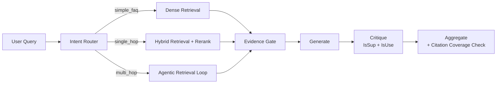

# ReflectRAG

An agentic RAG system built on LangGraph, featuring three-stage hybrid retrieval, dual-track self-reflection, and an enforced citation system.

This project is an architectural redesign based on [agentic-rag-for-dummies](https://github.com/GiovanniPasq/agentic-rag-for-dummies).

---

## Key Modifications

| Module | Upstream | ReflectRAG |
|---|---|---|
| Retrieval | BM25 + dense hybrid | + BGE-Reranker refinement (three-stage) |
| Generation-layer reflection | none | Critique node (IsSup + IsUse, bounded retry) |
| Query routing | none | Three-intent router (FAQ / single-hop / multi-hop) |
| Citations | none | Enforced `[chunk_id]` citations + coverage retry |
| Observability | none | Structured trace (8 event types) |
| Ablation | none | V0–V3 switchable configuration |

## Evaluation Results

| Metric | Value | Notes |
|---|---|---|
| MRR | 0.967 | paper-level retrieval |
| Retrieval match rate | 88.2% | gold source found in top-10 |
| Hallucination-free rate | 76.7% | user-perceived standard, V2 → V3 +32pp |
| Citation coverage | 0.89 | share of factual sentences carrying `[chunk_id]`; 0.95 for the FAQ path |
| Multi-hop latency | 33s → 19s | compression-threshold tuning + critique skip, −42% |
| Intent routing accuracy | 77% | three-class classification |

## Architecture



The intent router classifies each turn before any retrieval work happens. `simple_faq` takes a single dense lookup; `single_hop` runs the full hybrid pipeline with reranking; `multi_hop` enters the agentic loop with budgeted tool calls. Answers from every path converge at an Evidence Gate (hallucination veto), pass through the generation layer and the Critique node, and are finally aggregated with a citation-coverage check.

## Technical Implementation

### Three-stage retrieval

Recall stage fuses BM25 sparse signals with BGE-M3 dense embeddings through Qdrant's RRF hybrid search (2× over-fetch). The refinement stage scores every candidate with a BGE-Reranker-v2-m3 cross-encoder and keeps the top-k. The context stage expands winners through a parent-child index: child chunks drive precise matching, while parent chunks provide full-context evidence to the generator.

### Dual-track self-reflection

The retrieval track is an Evidence Gate: every drafted answer is checked for factual contradictions against the retrieved contexts. The generation track is a Critique node running two checks — IsSup (every factual claim must be supported by the evidence) and IsUse (the answer must actually address the question). Failed checks trigger one bounded retry with structured feedback; a circuit breaker caps the retry budget at 2.

### Enforced citations

The generation layer must attach a `[parent_id]` citation marker to every factual statement; statements without citable evidence must be omitted. The aggregation layer then scans the answer, computes citation coverage over its factual sentences, and — when more than 30% of those sentences lack a `[chunk_id]` marker — triggers one coverage retry before falling back to an explicit "no direct evidence" annotation.

## Ablation Study

| Variant | Configuration | Hallucination-free | MRR | Latency |
|---|---|---|---|---|
| V0 | dense only | 44% | 0.750 | 8.3s |
| V1 | + BM25 | 42% | 0.715 | 7.8s |
| V2 | + Reranker | 44% | 0.740 | 8.4s |
| V3 | + Critique + citations | 76.7% | 0.967 | 11.1s |

**Key finding:** the Critique layer's marginal contribution is concentrated in hallucination rate (+32pp); retrieval metrics do not differ significantly across V0–V3.

### Cross-scenario hallucination (dual standard)

| Scenario | Hallucination-free (strict) | Hallucination-free (user-perceived) | Leakage gap | MRR | Latency |
|---|---|---|---|---|---|
| Classic papers (30 items, V3) | 40.0% | 96.7% | 56.7pp | 0.967 | 9.6s |
| 2026 papers (20 items, V3) | 35.0% | 90.0% | 55.0pp | 1.000 | 14.8s |

The strict standard measures whether the system stays controllable; the user-perceived standard measures whether the user is deceived. The gap between them is parametric-knowledge leakage — factually correct statements that go beyond the retrieved contexts.

The cross-scenario comparison (classic papers vs. 2026 papers the model was never trained on) shows nearly identical leakage (56.7pp vs. 55.0pp), indicating that leakage is driven primarily by the generation layer's elaboration behavior rather than memorization of specific papers.

## Quick Start

```bash
git clone https://github.com/yourcplusplus/reflect-rag
cd reflect-rag

uv venv .venv && source .venv/bin/activate
uv pip install -r requirements.txt
```

Configure `project/.env` (`DEEPSEEK_API_KEY` + `HF_ENDPOINT`), then:

```bash
python project/app.py
```

Run an evaluation pass:

```bash
TRACE_ENABLED=true python evals/run_eval.py --variant V3
```

## Tech Stack

LangGraph · LangChain · Qdrant · BGE-M3 · BGE-Reranker-v2-m3 · DeepSeek API · Gradio · RAGAS

## Known Limitations

- On WSL2, GPU passthrough can intermittently segfault; development in CPU mode is recommended.
- The 76.7% hallucination-free rate is a user-perceived standard; under a strict RAG criterion it is roughly 50% — the gap comes from parametric knowledge leakage.
- Evaluation figures come from single runs, not repeated sampling.

## Acknowledgements

Based on [agentic-rag-for-dummies](https://github.com/GiovanniPasq/agentic-rag-for-dummies) (MIT License).

## License

MIT License — see [LICENSE](LICENSE).
